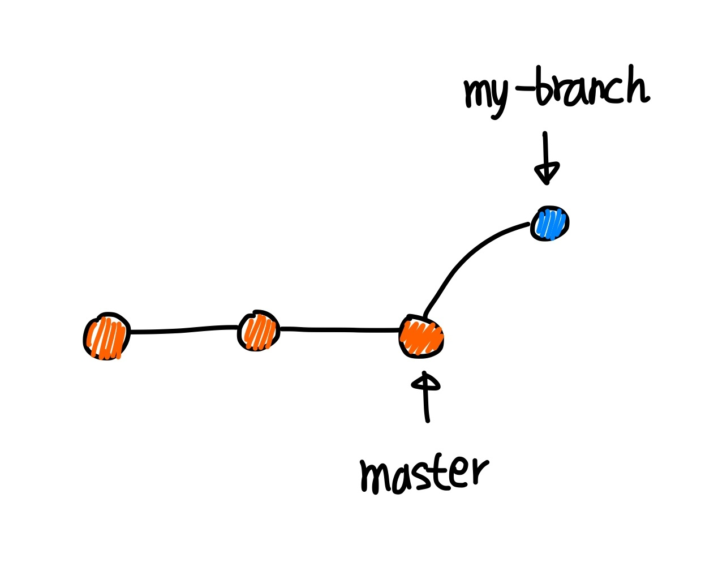
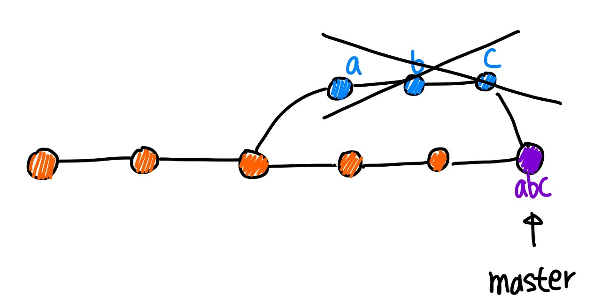

# 커밋 히스토리를 이쁘게 단장

---

## 커밋 히스토리가 왜 중요한가?

---

- 커밋 메시지만 보고도 어떤 `사항이 어떤 이유로 변경되었는지 쉽게 파악할수 있어야 한다`.

<aside>
🤔 중요한 이유 대표적 두가지

> 버그가 언제 터졌는지 파악하기 쉬움
> 
- 커밋 히스토리를 `보고 어떤 이유`로 `어떤 코드가 수정`되었는지 `빠르게 파악`할수 있으면 버그의 원인을 찾는것이 더 빨라진다

> 레거시 코드를 수정해야할 때
> 
- 레거시 코드를 석불리 수정했다가 `도미노처럼 와장창` 나는 경우가 있어 우리가 선택할수 있는 방법은 대략 4가지
    
    ```markdown
    1. 건드리기 무서우니까 그냥 냅둔다.
    2. 퇴사자한테 어떻게든 연락해서 물어본다.
    3. 주변에 있는 개발자를 붙잡고 물어본다.
    4. 그냥 내가 분석한다.
    ```
    
- 코드 수정할때 개발자가 남긴 `커밋 히스토리`를 읽고 바꾸는데 파악이 힘듬…
    - 그래서 개발자들이 `의미있는 단위의 커밋`, `의미 있는 커밋 메시지` 강조
</aside>

> 그래서 `히스토리를 깔끔하게` 만드는 3가지 머지 전략을 알아보자
> 

## 1. Merge

---

> `Main`이라는 중심의 브럱치가 존재하고 나는 `my-branch`라는 이름의 브런치를 만들어 코드 작업



<aside>

> 🤔 작업을 다 끝내고 `main` 브런치에 `merge`를 하려고 했는데, 내가 `merge` 하기 전에 누군가 `main` 브런치에 다른 작업을 한 후 `commit`하고 `push` 하면 이런모양.
>
> 
>
> 머지하면 이런 모양
> 


</aside>

- 이런경우 파악 하기 힘듬…

## 2. ****Squash and Merge****

---



> `commit` a + b + c를 합쳐서 새로운 `commit`, abc를 만들어지고 `main`에 추가된다.
> 
- feature 브랜치의 commit history를 합쳐서 깔끔하게 만들기 위해 사용한다

## 3.  ****Rebase and Merge****

---


> 모든 `commit`들이 합쳐지지 않고 각각 `main` 브랜치에 추가된다
> 
- `머지된 브랜치의 커밋`을 모두 살려놓기 때문에 누가 언제, 어떤 부분을 수정했다는 정보는 전부 알 수 있지만 해당 브랜치가 어느 시점에 머지되었는지는 알 수 없다