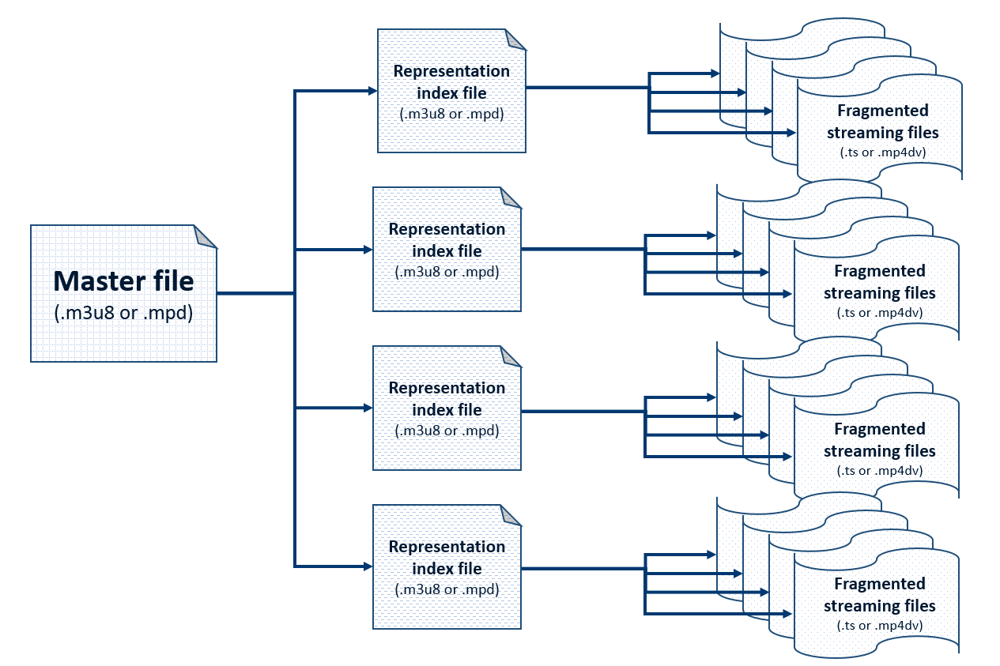

# hls란?

---

HLS(HTTP 라이브 스트리밍)은 널리 사용되고 있는 동영상 스트리밍 프로토콜로서 거의 모든 서버에서 작동할 수 있고 대부분의 장치가 지원합니다.

HLS로 클라이언트 장치는 스트리밍 품질을 높이거나 낮춰서 변화하는 네트워크 상태에 완벽하게 맞출 수 있습니다.

HLS는 Apple이 자사 제품에 사용하기 위해 개발했지만, 현재 다양한 장치에서 사용되고 있습니다

ex) 유튜브, netflix, watch 등등 ott 서비스 가 사용중임

HLS 프로토콜을 사용하면 네트워크 상태에 따라 영상 화질을 선택할 수 있는 Adaptive Bitrate Streaming을 사용할 수 있습니다.

그리고 클라이언트에서 영상을 청크 단위로 쪼개서 다운받을 수 있고, 부분 재생을 할 수 있는 기능도 제공합니다.

이러한 특징 덕분에 사용자는 영상 재생 시, 전체 영상 파일을 다운받지 않아도 되게 되었습니다.

그리고 특정 재생 위치부터 영상을 보는 경우, 해당 위치부터 영상을 다운받아 볼 수 있게 되었습니다.

## **m3u8 / ts 확장자 파일**

---



m3u8 파일에는 영상 재생을 위한 메타 정보들이 담겨있습니다.

이 메타 정보에는 대역폭별 m3u8 파일경로, 혹은 ts 파일경로 등이 담겨있습니다.

그리고 ts 파일은 실제 스트리밍 영상 데이터이며, 시간 단위로 작게 쪼개져 있습니다.

m3u8 파일을 통해 Adaptive Bitrate Streaming을 구현할 수 있고, ts 파일을 통해 영상을 부분 다운로드할 수 있게 된걸로 이해하면 좋을 것 같습니다.

tip) .ts 는 잘개 쪼개진 파일 . m3u8은 바로가기 파일

## **m3u8 샘플**

---

```tsx
#EXTM3U
#EXT-X-VERSION:3
#EXT-X-INDEPENDENT-SEGMENTS
#EXT-X-STREAM-INF:BANDWIDTH=3082123,AVERAGE-BANDWIDTH=3082123,CODECS="avc1.640028,mp4a.40.2",RESOLUTION=1080x1920,FRAME-RATE=29.970
2f898c392d6cb7cd69f9ca0bb3ffc642_20191216131423_hpt_q8.m3u8
#EXT-X-STREAM-INF:BANDWIDTH=3864924,AVERAGE-BANDWIDTH=3864924,CODECS="avc1.640028,mp4a.40.2",RESOLUTION=1080x1920,FRAME-RATE=29.970
2f898c392d6cb7cd69f9ca0bb3ffc642_20191216131423_hpt_q9.m3u8
#EXT-X-STREAM-INF:BANDWIDTH=5213165,AVERAGE-BANDWIDTH=5213165,CODECS="avc1.640028,mp4a.40.2",RESOLUTION=1080x1920,FRAME-RATE=29.970
2f898c392d6cb7cd69f9ca0bb3ffc642_20191216131423_hpt_q10.m3u8

```

```tsx
#EXTM3U
#EXT-X-VERSION:3
#EXT-X-TARGETDURATION:4
#EXT-X-MEDIA-SEQUENCE:1
#EXT-X-PLAYLIST-TYPE:VOD
#EXTINF:3,
2f898c392d6cb7cd69f9ca0bb3ffc642_20191216131423_hpt_q8_00001.ts
#EXTINF:3,
2f898c392d6cb7cd69f9ca0bb3ffc642_20191216131423_hpt_q8_00002.ts
#EXT-X-ENDLIST
```

첫번째 파일 샘플은 대역폭별 m3u8 파일 경로를 담고 있습니다.

두번째 파일은 대역폭별 m3u8 파일을 다운받은 후, 실제로 영상을 재생하기 위한 ts 파일 경로를 담고 있습니다.

## Stream segmenter

---


HSL으로 영상을 제공하기 위하여 필요한 데이터 흐름은 "원본 > 인코더 > **스트림 세그먼터** > 웹 서버 > 플레이어" 단계로 구성되어 있습니다.

스트림 세그먼터는 원본 데이터를 화질별로 잘게 분할하여, ts 파일을 만듭니다.