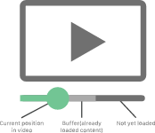

# 스트리밍 이란?

---

## 스트리밍 이란?

---

스트리밍은 인터넷을 통해 사용자에게 비디오 및 오디오 미디어를 전달하는 방법입니다. 미디어 파일을 한 번에 모두 보내는 대신 한 번에 조금씩 지속적으로 사용자 장치에 보냅니다. 원 미디어 파일은 멀리 떨어진 곳에 저장되어 있거나 라이브 스트리밍의 경우 원격 카메라나 마이크를 이용하여 실시간으로 제작됩니다. 따라서 사용자의 장치가 먼저 모든 파일을 다운로드하지 않고 비디오 또는 오디오를 재생할 수 있습니다.

## ****스트리밍과 다운로드의 차이점****

---

스트리밍은 실시간 이며 미디어 파일을 다운 로드 하는것 보다 더 효율적이다. 미디어 파일을 저장 하면 전체 파일의 복사본이 로컬 데이터에 저장됩니다, 전체 파일이 저장이 다 될때까지 파일을 열수 없습니다.

대신 스트리밍되는 경우 브라우저는 실제로 복사 및 저장하지 않고 비디오를 재생합니다.

동영상은 전체 파일을 로드 하는 대신에 조금씩 조금씩 로드하며 브라우저가 로드 하는 데이터는 저장되지 않습니다.

## **스트리밍은 어떻게 작동합니까?**

---

인터넷을 통해 전송되는 다른 데이터와 마찬가지로 오디오 및 비디오 데이터는 데이터 패킷으로 나뉩니다. 각 패킷에는 파일의 작은 조각이 포함되어 있으며 클라이언트 장치의 브라우저에 있는 오디오 또는 비디오 플레이어는 데이터 패킷의 흐름을 가져와 비디오 또는 오디오로 해석합니다.

## ****스트리밍은 UDP(사용자 데이터그램 프로토콜) 과 TCP(전송 제어 프로토콜)중 어떤것을 사용하나?****

---

### **UDP : 빠르지만 패킷 손실이 일어날수 있음**

### TCP : UDP 보단 느리지만 패킷 손실이 적고 안정적임

---

각자 사용하는 환경이 다르다 예를 들자면 zoom 같은 화상 채팅과 같은 빠르게 빠르게 의사 소통 해야 하는 어플리케이션은 `UDP`를 사용 하지만,

OTT 서비스와 같은 실시간으로 상호 작용 하는게 아닌것은 `TCP` 를 사용합니다.

## 버퍼링

---

연결이 끊길때 오디오나 비디오가 재생될 수 있도록 몇 초 전의 스트림을 로드 한다. 이 때문에 비디오가 원활 하게 재생될수 있다. 하지만 인터넷 느릴때는 대기시간이 길어짐

## **스트리밍을 더 빠르게 하려면 어떻게 해야 합니까?**

---

거리가 길면 길수록 스트리밍을 시도 하는 사용자 에게 비디오 콘텐츠가 엄청 긴 길이를 거쳐 가야 하는데 이 때문에 오랜 버퍼링이 생겨 Netflix 와 같은 서비스는 사용자에게 가까운 곳에 데이터 박스를 놔둬 전세계 위치에 콘텐츠를 저장하는 분상형 콘텐츠 전송 네트워크(CDN)를 사용한다.

[https://www.youtube.com/watch?v=_DDkSF5TvEU](https://www.youtube.com/watch?v=_DDkSF5TvEU)

tip) 그래서 vpn 쓰고 넷플 보면 한국에서 안 보이는 다른 콘텐츠를 볼수 있음